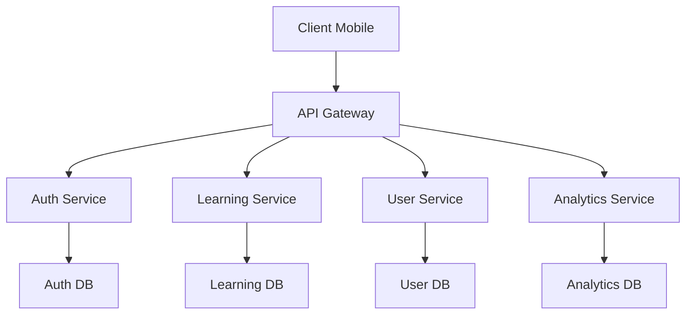
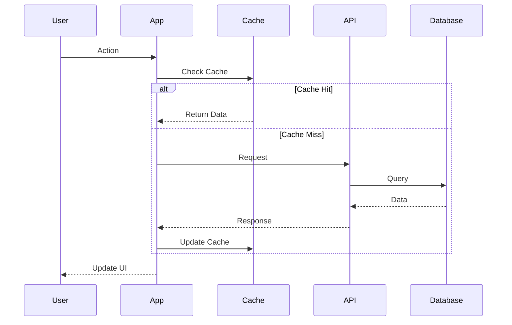

# DOCUMENTATION COMPLÉMENTAIRE
Version 1.0.0 | Janvier 2025

## ARCHITECTURE DÉTAILLÉE

### 1. Architecture des Microservices


### 2. Flux de Données


## OPTIMISATIONS AVANCÉES

### 1. Optimisation des Images
```typescript
// utils/imageOptimization.ts
interface ImageOptimizationConfig {
  quality: number;
  maxWidth: number;
  maxHeight: number;
  format: 'jpeg' | 'png' | 'webp';
}

const defaultConfig: ImageOptimizationConfig = {
  quality: 0.8,
  maxWidth: 1200,
  maxHeight: 1200,
  format: 'webp'
};

export async function optimizeImage(
  uri: string,
  config: Partial<ImageOptimizationConfig> = {}
): Promise<string> {
  const finalConfig = { ...defaultConfig, ...config };
  // Implémentation de l'optimisation
}
```

### 2. Gestion Avancée du Cache
```typescript
// services/cacheManager.ts
interface CacheConfig {
  ttl: number;
  maxSize: number;
  priority: 'high' | 'medium' | 'low';
}

class AdvancedCacheManager {
  private static instance: AdvancedCacheManager;
  private cache: Map<string, any>;
  private metadata: Map<string, CacheConfig>;

  async set(key: string, data: any, config: CacheConfig): Promise<void> {
    // Implémentation
  }

  async get(key: string): Promise<any> {
    // Implémentation
  }

  async invalidate(pattern: RegExp): Promise<void> {
    // Implémentation
  }
}
```

## SÉCURITÉ AVANCÉE

### 1. Chiffrement des Données
```typescript
// security/encryption.ts
import { AES, enc } from 'crypto-js';

export class DataEncryption {
  private static readonly KEY = process.env.ENCRYPTION_KEY;
  
  static encrypt(data: any): string {
    return AES.encrypt(
      JSON.stringify(data),
      this.KEY
    ).toString();
  }
  
  static decrypt(encryptedData: string): any {
    const bytes = AES.decrypt(encryptedData, this.KEY);
    return JSON.parse(bytes.toString(enc.Utf8));
  }
}
```

### 2. Protection Contre les Attaques
```typescript
// security/protection.ts
export class SecurityProtection {
  static readonly RATE_LIMIT = {
    window: 15 * 60 * 1000, // 15 minutes
    max: 100 // requêtes
  };

  static readonly SQL_INJECTION_PATTERNS = [
    /(\b(SELECT|INSERT|UPDATE|DELETE|DROP|UNION)\b)/i,
    /('(''|[^'])*')/i,
    /(--)/
  ];

  static validateInput(input: string): boolean {
    return !this.SQL_INJECTION_PATTERNS.some(pattern => 
      pattern.test(input)
    );
  }
}
```

## TESTS AVANCÉS

### 1. Tests de Performance
```typescript
// tests/performance.test.ts
import { PerformanceObserver, performance } from 'perf_hooks';

describe('Performance Tests', () => {
  let perfObserver: PerformanceObserver;

  beforeAll(() => {
    perfObserver = new PerformanceObserver((items) => {
      items.getEntries().forEach((entry) => {
        expect(entry.duration).toBeLessThan(100);
      });
    });
    perfObserver.observe({ entryTypes: ['measure'] });
  });

  test('Component Render Performance', async () => {
    performance.mark('start-render');
    // Test de rendu
    performance.mark('end-render');
    performance.measure('render-time', 'start-render', 'end-render');
  });
});
```

### 2. Tests de Charge
```typescript
// tests/load.test.ts
import { LoadTest } from './utils/loadTest';

describe('Load Tests', () => {
  const loadTest = new LoadTest({
    users: 1000,
    duration: '5m',
    rampUp: '30s'
  });

  test('API Endpoints Under Load', async () => {
    const results = await loadTest.run([
      {
        endpoint: '/api/lessons',
        method: 'GET',
        expectedRPS: 100
      },
      {
        endpoint: '/api/user/progress',
        method: 'POST',
        expectedRPS: 50
      }
    ]);

    expect(results.failureRate).toBeLessThan(0.01);
    expect(results.p95ResponseTime).toBeLessThan(200);
  });
});
```

## MONITORING AVANCÉ

### 1. Métriques Personnalisées
```typescript
// monitoring/metrics.ts
interface CustomMetric {
  name: string;
  value: number;
  tags: Record<string, string>;
  timestamp: number;
}

class MetricsCollector {
  private metrics: CustomMetric[] = [];

  track(metric: CustomMetric): void {
    this.metrics.push({
      ...metric,
      timestamp: Date.now()
    });
  }

  async flush(): Promise<void> {
    // Envoi des métriques au service de monitoring
  }
}
```

### 2. Alertes Intelligentes
```typescript
// monitoring/alerts.ts
interface AlertConfig {
  metric: string;
  threshold: number;
  window: number;
  severity: 'low' | 'medium' | 'high';
  action: (alert: Alert) => Promise<void>;
}

class AlertManager {
  private configs: AlertConfig[] = [];

  addAlert(config: AlertConfig): void {
    this.configs.push(config);
  }

  async check(metrics: CustomMetric[]): Promise<void> {
    // Vérification et déclenchement des alertes
  }
}
```

## INTERNATIONALISATION

### 1. Configuration i18n
```typescript
// i18n/config.ts
import i18n from 'i18next';

export const setupI18n = () => {
  i18n.init({
    fallbackLng: 'fr',
    supportedLngs: ['fr', 'en', 'es', 'de'],
    interpolation: {
      escapeValue: false
    },
    backend: {
      loadPath: '/locales/{{lng}}/{{ns}}.json'
    }
  });
};
```

### 2. Gestion des Traductions
```typescript
// i18n/translations.ts
export const loadTranslations = async (
  language: string
): Promise<void> => {
  const translations = await import(
    `../assets/locales/${language}.json`
  );
  
  await i18n.addResourceBundle(
    language,
    'common',
    translations.default
  );
};
```

## ACCESSIBILITÉ

### 1. Configuration WCAG
```typescript
// accessibility/config.ts
export const accessibilityConfig = {
  minimumContrastRatio: 4.5,
  targetTouchSize: {
    width: 44,
    height: 44
  },
  fontScaling: {
    minimum: 16,
    maximum: 32
  }
};
```

### 2. Composants Accessibles
```typescript
// components/AccessibleButton.tsx
interface AccessibleButtonProps {
  label: string;
  onPress: () => void;
  accessibilityRole?: AccessibilityRole;
  accessibilityLabel?: string;
  accessibilityHint?: string;
}

export const AccessibleButton: React.FC<
  AccessibleButtonProps
> = ({
  label,
  onPress,
  accessibilityRole = 'button',
  accessibilityLabel,
  accessibilityHint
}) => {
  return (
    <TouchableOpacity
      onPress={onPress}
      accessible={true}
      accessibilityRole={accessibilityRole}
      accessibilityLabel={accessibilityLabel || label}
      accessibilityHint={accessibilityHint}
      style={styles.button}
    >
      <Text style={styles.label}>{label}</Text>
    </TouchableOpacity>
  );
};
```

## DOCUMENTATION API

### 1. Swagger Configuration
```yaml
# swagger.yaml
openapi: 3.0.0
info:
  title: API Éducative
  version: 1.0.0
  description: API complète pour l'application éducative
paths:
  /api/lessons:
    get:
      summary: Récupérer les leçons
      parameters:
        - name: level
          in: query
          schema:
            type: string
      responses:
        '200':
          description: Liste des leçons
          content:
            application/json:
              schema:
                type: array
                items:
                  $ref: '#/components/schemas/Lesson'
```

### 2. Postman Collection
```json
{
  "info": {
    "name": "API Éducative",
    "schema": "https://schema.getpostman.com/json/collection/v2.1.0/collection.json"
  },
  "item": [
    {
      "name": "Leçons",
      "request": {
        "method": "GET",
        "url": {
          "raw": "{{baseUrl}}/api/lessons?level={{level}}"
        }
      }
    }
  ]
}
```

## SCRIPTS UTILITAIRES

### 1. Analyse de Performance
```bash
#!/bin/bash
# scripts/analyze-performance.sh

echo "Analyzing application performance..."

# Lighthouse
lighthouse https://education-app.com \
  --output json \
  --output-path ./reports/lighthouse.json

# Bundle size
source-map-explorer dist/*.js \
  --html ./reports/bundle-analysis.html

# Memory usage
node --expose-gc ./scripts/memory-profile.js
```

### 2. Maintenance Automatisée
```bash
#!/bin/bash
# scripts/maintenance.sh

# Nettoyage
echo "Cleaning up..."
rm -rf ./tmp/*
npm cache clean --force

# Mise à jour des dépendances
echo "Updating dependencies..."
npm update
npm audit fix

# Backup
echo "Creating backup..."
./scripts/backup.sh

# Tests
echo "Running tests..."
npm test

# Rapport
echo "Generating report..."
./scripts/generate-report.sh
```

## CONTACT ET SUPPORT

### Support Technique
- **Email Principal** : tech-support@education-app.com
- **Email Urgent** : urgent@education-app.com
- **Téléphone** : +XX XXX XXX XXX
- **Slack** : #tech-support

### Documentation
- **Wiki** : https://wiki.education-app.com
- **API** : https://api.education-app.com/docs
- **Storybook** : https://ui.education-app.com

### Outils
- **Monitoring** : https://monitor.education-app.com
- **Analytics** : https://analytics.education-app.com
- **Logs** : https://logs.education-app.com

---

Note : Cette documentation est mise à jour régulièrement. Dernière mise à jour : 17 janvier 2025.
